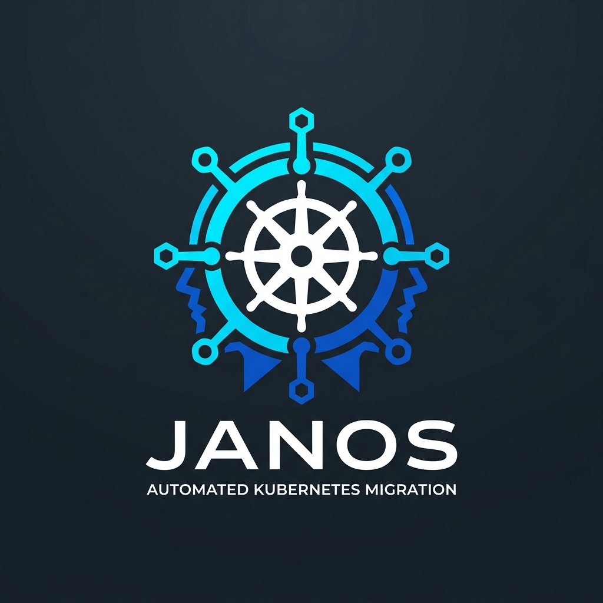

<div align="center">



# Janos

**The Automated Kubernetes Manifest Migration & Gateway API Transition Tool**

*Effortlessly upgrade your Kubernetes manifests from version 1.16 to 1.32+, audit deprecated APIs in live clusters or GitOps repos, and convert Ingress to Gateway API — while keeping 100% of your YAML comments and formatting intact.*

[](https://github.com/pgold30/janos/actions/workflows/ci.yml)
[](https://nodejs.org/)
[](LICENSE.md)
[](CODE_OF_CONDUCT.md)

</div>

---

> **Why Janos?**
>
> In Roman mythology, **Janus** (Janos) is the god of transitions, doors, and passages — with two faces looking simultaneously into the past and into the future.
>
> When upgrading Kubernetes clusters, deprecated and removed APIs inevitably break deployments. Running manual find-and-replace across hundreds of GitOps repositories or Helm manifests is tedious, error-prone, and destroys your comments.
>
> **Janos bridges the gap**: it audits your manifests and live clusters (like Pluto), updates deprecated `apiVersion`s in-place with target version gating, converts Ingresses to modern Gateway API `HTTPRoute`s (like `ingress2gateway`), and writes upgraded files back — **without stripping a single comment or reformatting your whitespace**.

---

## 🥊 Why Janos vs. Pluto & `kubectl-convert`?

| Core Capability | Pluto (Fairwinds) | `kubectl-convert` (Official) | **Janos 2.3** |
| :--- | :---: | :---: | :---: |
| **Fixes manifests in-place?** | ❌ No (Read-only auditor) | ❌ No (Single file to stdout) | ✅ **Yes, recursive directory updates** |
| **Preserves YAML comments?** | ➖ N/A (Doesn't modify files) | ❌ **Strips 100% of comments** | ✅ **100% Preserved (AST engine)** |
| **Live Cluster & Helm Audit?** | ✅ Yes (Helm & cluster read-only) | ❌ No | ✅ **Yes (`--cluster`, `--chart`, unrendered templates)** |
| **Target Version Gating?** | ⚠️ Filter only | ❌ No (Forces latest API, breaking staged upgrades) | ✅ **`--target-version <v>` safe incremental upgrades** |
| **Ingress ➔ Gateway API?** | ❌ No | ❌ No | ✅ **Built-in (`--ingress-to-gateway`)** |
| **Git Blame & Provenance?** | ❌ No | ❌ No | ✅ **`--annotate`, `--stamp`, `--git-blame-ignore`** |

---

## ⚡ Quick Start: How to Use

Run immediately anywhere via `npx` (zero install needed):

### 1. Audit for Deprecated APIs (Read-Only)
Find out what will break in your repository or running cluster without changing a single file:
```sh
# Audit all YAML manifests in a directory:
npx janos --audit -d ./k8s

# Audit an active Kubernetes cluster directly via kubectl:
npx janos --cluster --audit

# Focus only on APIs completely removed in your target version:
npx janos --audit -d ./k8s --target-version 1.25 --only-removed
```

Example audit report output with severity tags:

| Kind | Name | Namespace | Current API | Target API | Removed In | Status | File |
| :--- | :--- | :--- | :--- | :--- | :---: | :---: | :--- |
| Ingress | `web-ingress` | `default` | `extensions/v1beta1` | **`networking.k8s.io/v1`** | **v1.22** | 🔴 REMOVED | `k8s/ingress.yaml` |
| CronJob | `cleanup` | `prod` | `batch/v1beta1` | **`batch/v1`** | **v1.25** | 🟡 DEPRECATED | `k8s/cron.yaml` |

### 2. Preview Changes with Colored Diff (`--diff`)
See the exact unified diff before modifying anything:
```sh
npx janos -d ./k8s --dry-run --diff
```

### 3. Migrate In-Place (100% Comment-Safe)
Upgrade all manifests in your repository, keeping all `# comments` and indentation intact:
```sh
# Option A: Automatic in-place migration across the entire directory:
npx janos -d ./k8s

# Option B: Interactive mode — review & confirm each file (y/n/d/a/q):
npx janos -d ./k8s -i
```

*In interactive mode (`-i`), Janos prompts for each changed file (`[y]es, [n]o, [d]iff, [a]ll, [q]uit`), giving you total control just like `git add -p`.*

### 4. Gate to Your Target Cluster Version (`--target-version`)
Upgrading from 1.22 to 1.25? Don't prematurely apply 1.26 or 1.29 changes. Gate migrations strictly to your cluster's target version:
```sh
npx janos -d ./k8s --target-version 1.25 --diff
```

### 5. Convert Ingress to Gateway API (`--ingress-to-gateway`)
Modernize legacy Ingresses into Gateway API `HTTPRoute` resources (with path matching, rewrites, and SSL redirect filters):
```sh
# Generate HTTPRoute alongside your Ingress:
npx janos --ingress-to-gateway -f ingress.yaml

# Generate HTTPRoute AND companion Gateway resource:
npx janos --ingress-to-gateway --generate-gateway -f ingress.yaml --out gateway.yaml
```

### 6. Track Provenance & Keep Git Blame Clean (`--annotate`, `--git-blame-ignore`)
Keep track of what changed without polluting your git history:
```sh
# Stamp upgraded resources with metadata annotations:
npx janos -d ./k8s --annotate

# Append inline comments showing the replaced API version:
npx janos -d ./k8s --annotate-inline

# Configure git blame to ignore the migration commit:
git commit -am "chore: migrate deprecated kubernetes APIs"
npx janos --git-blame-ignore
```

With `--annotate` (or `--stamp`), Janos embeds provenance metadata:
```yaml
metadata:
  annotations:
    janos.io/migrated-from: "batch/v1beta1"
    janos.io/migrated-at: "2026-09-16T12:00:00.000Z"
    janos.io/upgraded-by: "janos-v2.3.0"
```
And with `--annotate-inline`:
```yaml
apiVersion: batch/v1 # [janos]: migrated from batch/v1beta1
kind: CronJob
```

---

## 🔧 Advanced Usage & Integrations

*(For GitOps pipelines, Helm charts, Unix streams, and automated CI/CD pull request checks)*

### 1. ⎈ Helm Chart & Template Support
Janos provides native support for Helm without breaking Go template syntax:
- **Render & Audit Charts**:
  ```sh
  npx janos --chart ./charts/my-app --audit
  npx janos --chart ./charts/my-app --values ./prod-values.yaml --audit --format markdown
  ```
- **Migrate Raw Helm Templates In-Place**:
  Safely updates `apiVersion`s inside `templates/*.yaml` while keeping all `{{ ... }}` Go expressions byte-for-byte untouched:
  ```sh
  npx janos -d ./charts/my-app/templates
  ```

### 2. 🚰 Unix Piping & Stream Processing (`-`)
Pipe rendered output from `helm`, `kustomize`, or `cat` directly through Janos:
```sh
# Audit Helm template stream:
helm template my-release ./charts/my-app | npx janos - --audit --format markdown

# Diff Kustomize build stream:
kustomize build overlays/production | npx janos - --diff

# Stream and save upgraded manifests:
cat legacy-deploy.yaml | npx janos - > modern-deploy.yaml
```

### 3. 🤖 GitHub Actions CI & PR Comment Bot
Automatically scan pull requests in CI and block deprecated APIs:
```yaml
name: Kubernetes Deprecation Gate

on: [pull_request]

jobs:
  audit:
    runs-on: ubuntu-latest
    steps:
      - uses: actions/checkout@v4

      - name: Audit Kubernetes Manifests
        uses: pgold30/janos@master
        with:
          path: './k8s'
          args: '--audit --format markdown'
          check: 'true'
          target-version: '1.25'
```
*Janos automatically adds PR line annotations (`::warning`) and writes markdown summary tables to the GitHub Actions Job Summary.*

### 4. 🪝 Pre-commit Hook Integration
Block deprecated manifests from ever being committed to git. Add to `.pre-commit-config.yaml`:
```yaml
repos:
  - repo: https://github.com/pgold30/janos
    rev: v2.2.0
    hooks:
      - id: janos-audit     # Read-only verification before commit
      # - id: janos-migrate # Or auto-migrate in-place before commit
```

### 5. 🌐 Cluster Filters & Exporting
```sh
# Filter live cluster audit to a single namespace:
npx janos --cluster --namespace staging --audit

# Specify a custom kubeconfig file:
npx janos --cluster --kubeconfig ~/.kube/staging-config --audit

# Save audit report directly to a file:
npx janos --audit -d ./k8s --format markdown --output-file audit-report.md
```

---

## 🛠️ CLI Options Reference

```text
Usage:
  janos [options] [path]
  <stream> | janos - [options]

Core Options:
  -f, --file <file>             Target single manifest file to convert ('-' for stdin)
  -d, --dir <dir>               Target directory to recursively scan and convert
  -i, --interactive             Interactive mode: confirm each file modification (y/n/d/a/q)
      --stdin                   Read manifests from standard input (pipe)
  -n, --dry-run                 Preview changes without modifying files
      --diff                    Show unified color diff of changes
  -c, --check                   CI mode: exit 1 if any files need migration, 0 if clean

Audit & Filter Options:
      --audit, --scan           Pluto-style read-only audit: scan and print summary table
      --target-version <ver>    Gate migrations up to a specific Kubernetes version (e.g. 1.25)
      --only-removed            Audit: only list APIs that are completely removed in target version
      --format <format>         Output format: table (default), markdown, json, or annotations
      --output-file <file>      Write audit report directly to a file

Cluster & Helm Options:
      --cluster, --live         Audit running Kubernetes cluster directly via kubectl
      --namespace <ns>          Namespace filter for live cluster audit (default: all namespaces)
      --kubeconfig <file>       Custom kubeconfig file path
      --chart, --helm <dir>     Scan or render Helm chart directory via 'helm template'
      --values <file>           Specify values YAML file for Helm chart rendering

Gateway API Options:
      --ingress-to-gateway      Translate Ingress manifests to Gateway API (HTTPRoute)
      --generate-gateway        Generate companion Gateway resource with --ingress-to-gateway
      --out <file>              Output file path for generated resources (default: in-place or stdout)

Provenance & Git Options:
      --annotate, --stamp       Stamp upgraded manifests with janos.io/migrated-* metadata annotations
      --annotate-inline         Append inline comments to upgraded lines (e.g. # [janos]: migrated from ...)
      --git-blame-ignore        Create/update .git-blame-ignore-revs and configure git to preserve blame history

General & CI:
      --ignore <patterns>       Comma-separated glob ignore patterns (or use .janosignore)
      --annotations             Emit GitHub Actions workflow annotations (auto in CI)
  -q, --quiet                   Suppress non-essential output
  -v, --version                 Print version information
  -h, --help                    Print this help message
```

---

## 📋 Supported API Migrations (v1.16 – v1.32+)

| Resource Kind | Deprecated / Removed Versions | Target Version | Removed In | Transformation Details |
| :--- | :--- | :--- | :---: | :--- |
| **Deployment** | `extensions/v1beta1`, `apps/v1beta1`, `apps/v1beta2` | `apps/v1` | 1.16 | Generates required `spec.selector` if missing |
| **DaemonSet** | `extensions/v1beta1`, `apps/v1beta2` | `apps/v1` | 1.16 | Generates required `spec.selector` if missing |
| **StatefulSet** | `apps/v1beta1`, `apps/v1beta2` | `apps/v1` | 1.16 | Generates required `spec.selector` if missing |
| **ReplicaSet** | `extensions/v1beta1`, `apps/v1beta1`, `apps/v1beta2` | `apps/v1` | 1.16 | Generates required `spec.selector` if missing |
| **NetworkPolicy** | `extensions/v1beta1` | `networking.k8s.io/v1` | 1.16 | API version update |
| **Role / ClusterRole** | `rbac.authorization.k8s.io/v1alpha1`, `v1beta1` | `rbac.authorization.k8s.io/v1` | 1.17 / 1.22 | Full RBAC v1 migration |
| **RoleBinding / ClusterRoleBinding** | `rbac.authorization.k8s.io/v1alpha1`, `v1beta1` | `rbac.authorization.k8s.io/v1` | 1.17 / 1.22 | Full RBAC v1 migration |
| **Ingress** | `extensions/v1beta1`, `networking.k8s.io/v1beta1` | `networking.k8s.io/v1` | 1.22 | Migrates `spec.backend` to `defaultBackend`, converts `serviceName`/`servicePort` to `service.name`/`port`, adds `pathType: Prefix` (or convert to Gateway API with `--ingress-to-gateway`) |
| **IngressClass** | `networking.k8s.io/v1beta1` | `networking.k8s.io/v1` | 1.22 | API version update |
| **CustomResourceDefinition** | `apiextensions.k8s.io/v1beta1` | `apiextensions.k8s.io/v1` | 1.22 | API version update |
| **ValidatingWebhookConfiguration** | `admissionregistration.k8s.io/v1beta1` | `admissionregistration.k8s.io/v1` | 1.22 | API version update |
| **MutatingWebhookConfiguration** | `admissionregistration.k8s.io/v1beta1` | `admissionregistration.k8s.io/v1` | 1.22 | API version update |
| **StorageClass / CSIDriver / CSINode** | `storage.k8s.io/v1beta1` | `storage.k8s.io/v1` | 1.22 | API version update |
| **VolumeAttachment** | `storage.k8s.io/v1beta1` | `storage.k8s.io/v1` | 1.22 | API version update |
| **APIService** | `apiregistration.k8s.io/v1beta1` | `apiregistration.k8s.io/v1` | 1.22 | API version update |
| **PriorityClass** | `scheduling.k8s.io/v1beta1` | `scheduling.k8s.io/v1` | 1.22 | API version update |
| **Lease** | `coordination.k8s.io/v1beta1` | `coordination.k8s.io/v1` | 1.22 | API version update |
| **CertificateSigningRequest** | `certificates.k8s.io/v1beta1` | `certificates.k8s.io/v1` | 1.22 | API version update |
| **TokenReview / SubjectAccessReview** | `authentication/authorization.k8s.io/v1beta1` | `authentication/authorization.k8s.io/v1` | 1.22 | Full v1 authorization review migration |
| **CronJob** | `batch/v1beta1` | `batch/v1` | 1.25 | Batch v1 migration |
| **PodDisruptionBudget** | `policy/v1beta1` | `policy/v1` | 1.25 | Policy v1 migration |
| **EndpointSlice** | `discovery.k8s.io/v1beta1` | `discovery.k8s.io/v1` | 1.25 | Discovery v1 migration |
| **Event** | `events.k8s.io/v1beta1` | `events.k8s.io/v1` | 1.25 | Events v1 migration |
| **RuntimeClass** | `node.k8s.io/v1beta1` | `node.k8s.io/v1` | 1.25 | Node v1 migration |
| **HorizontalPodAutoscaler** | `autoscaling/v2beta1`, `v2beta2` | `autoscaling/v2` | 1.25 / 1.26 | Migrates metric target specifications to `target.type/averageUtilization` |
| **CSIStorageCapacity** | `storage.k8s.io/v1beta1` | `storage.k8s.io/v1` | 1.27 | Storage v1 migration |
| **FlowSchema / PriorityLevelConfig** | `flowcontrol.apiserver.k8s.io/v1beta1..3` | `flowcontrol.apiserver.k8s.io/v1` | 1.26–1.32 | Flow control v1 migration |
| **PodSecurityPolicy** | `extensions/v1beta1`, `apps/v1beta2` | `policy/v1beta1` | 1.25 | Emits migration warning for Pod Security Admission |

---

## 🧪 Development & Testing

Janos uses Node's native zero-dependency test runner (`node:test`):

```sh
# Run full test suite:
npm test

# Run tests in watch mode:
node --test --watch
```

---

## 👤 Maintainer

Created and maintained with ❤️ by **Pablo Loschi**:
- **GitHub**: [@pgold30](https://github.com/pgold30)
- **Email**: [loschi.pablo@gmail.com](mailto:loschi.pablo@gmail.com)
- **Medium**: [@pgold30](https://medium.com/@pgold30)

## 📄 License

Apache License 2.0. See [LICENSE.md](LICENSE.md) for details.
